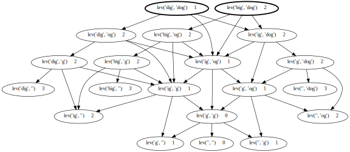

Callgraph Magic
===============

|PyPI version| |Doc Status| |License| |Supported Python|

Callgraph is a Python package that defines a decorator, and Jupyter magic,
to draw `dynamic call graphs`_ of Python function calls.

It’s intended for classroom use, but may also be useful for self-guided
exploration.

The package defines a Jupyter `IPython`_ `magic`_, ``%callgraph``, that
displays a call graph within a Jupyter cell:

.. code:: python

    from functools import lru_cache

    @lru_cache()
    def lev(a, b):
        if "" in (a, b):
            return len(a) + len(b)

        candidates = []
        if a[0] == b[0]:
            candidates.append(lev(a[1:], b[1:]))
        else:
            candidates.append(lev(a[1:], b[1:]) + 1)
        candidates.append(lev(a, b[1:]) + 1)
        candidates.append(lev(a[1:], b) + 1)
        return min(candidates)

    %callgraph -w10 lev("big", "dog"); lev("dig", "dog")

|image0|

It also provides a Python decorator, ``callgraph.decorator``, that
instruments a function to collect call graph information and render the
result.

Jupyter / IPython Usage
-----------------------

.. code:: bash

    $ pip install callgraph

In a Jupyter IPython notebook:

.. code:: python

    %load_ext callgraph

    def nchoosek(n, k):
        if k == 0:
            return 1
        if n == k:
            return 1
        return nchoosek(n - 1, k - 1) + nchoosek(n - 1, k)

    %callgraph nchoosek(4, 2)

As an alternative to including ``%load_ext callgraph`` in each notebook that
uses ``%callgraph``, you can add the extension to the Notebook
configuration file in your IPython profile.

Your configuration file is probably called ``~/.ipython/profile_default/ipython_config.py``.
(You can run ``ipython profile locate`` to find it.)
Edit this file to include the following line::

    c.InteractiveShellApp.extensions = ["callgraph.extension"]

(If your configuration file already includes an uncommented statement
``c.InteractiveShellApp.extensions = […]``, edit the list of extensions in
that line to include ``"callgraph.extension"``.

See `extension example notebook`_ for additional examples.

Decorator Usage
---------------

.. code:: bash

    $ pip install callgraph

.. code:: python

    from functools import lru_cache
    import callgraph.decorator as callgraph

    @callgraph()
    @lru_cache()
    def nchoosek(n, k):
        if k == 0:
            return 1
        if n == k:
            return 1
        return nchoosek(n - 1, k - 1) + nchoosek(n - 1, k)

    nchoosek(5, 2)

    nchoosek.__callgraph__.view()

See the `API documentation`_ for additional documentation.

See the `decorator example notebook`_ for additional instructions and examples.

Development
-----------

Install dev tools, and set up a Jupyter kernel for the current python
enviromnent:

.. code:: bash

    $ pip install -r requirements-dev.txt
    $ python -m ipykernel install --user

Install locally:

.. code:: bash

    flit install --symlink

Acknowledgements
----------------

Callgraph uses the Python `graphviz package`_. Python graphviz uses
the `Graphviz`_ package.

License
-------

MIT

.. |PyPI version| image:: https://img.shields.io/pypi/v/callgraph.svg
    :target: https://pypi.python.org/pypi/callgraph
    :alt: Latest PyPI Version
.. |Doc Status| image:: https://readthedocs.org/projects/callgraph/badge/?version=latest
    :target: http://callgraph.readthedocs.io/en/latest/?badge=latest
    :alt: Documentation Status
.. |License| image:: https://img.shields.io/pypi/l/callgraph.svg
    :target: https://pypi.python.org/pypi/callgraph
    :alt: License
.. |Supported Python| image:: https://img.shields.io/pypi/pyversions/callgraph.svg
    :target: https://pypi.python.org/pypi/callgraph
    :alt: Supported Python Versions

.. _dynamic call graphs: https://en.wikipedia.org/wiki/Call_graph
.. _IPython: https://ipython.org
.. _magic: http://ipython.readthedocs.io/en/stable/interactive/magics.html
.. _graphviz package: https://github.com/xflr6/graphviz
.. _Graphviz: https://www.graphviz.org

.. _API documentation: http://callgraph.readthedocs.io/en/latest/?badge=latest#module-callgraph
.. _extension example notebook: https://github.com/osteele/callgraph/blob/master/examples/callgraph-magic-examples.ipynb
.. _decorator example notebook: https://github.com/osteele/callgraph/blob/master/examples/callgraph-decorator-examples.ipynb
